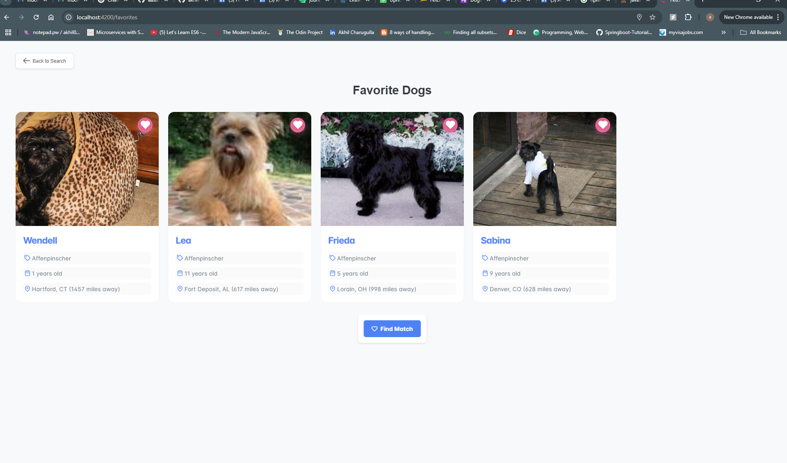
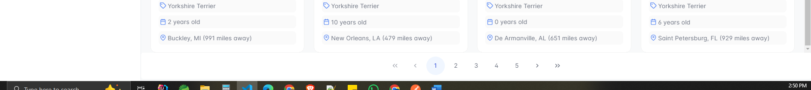

# Fetchrewards
This project was generated with [Angular CLI](https://github.com/angular/angular-cli) version 18.1.4.

## Development server
Run `ng serve` for a dev server. Navigate to `http://localhost:4200/`. The application will automatically reload if you change any of the source files.

How to run project:
1) Clone the project and do npm i -force
2) Go to project fetch rewards and perform ng serve
3) Open port 4200 in local (http://localhost:4200/) 

Note: I have chosen primeng with nagular for this project. I have  primeng 17 because it is supoprted by angular 18.

Once user logs on login page, pass a credential and once authenticated we land on search page.

Users can Favourite a dog and check the favorites item when they route to favorite route.

favorites page

User can view the dog card on clciking image 

User can get a match based on their favorites

Match can be performed on favorite page too

Filter:
By feault the dog breeds are displayed alphabetically. User can sort the dogs based on breeds

Example:  Sorted breeds Z-A

And users can sort according to dogs name.

User can filter dogs by adding filters in filter sidebar

Similar way a user can filter breeds according to location and cities..

I have pagination implemented at the bottom.

There is search feature, where we can search with dog breeeds

Api Calls:
When user logs in it call the login post api call /login
Once user logs in it calls the /breeds end point, which loads all the breeds.
To fill the items in grid, the dog cards by default dog ids are fetched from /search url
Once we get dog Ids we call the /dogs api using the dogids as payload and we get the information of each dogs.
The /locations api is called with zipcodes (which we got from /dogs) to get the exact location of dogs and populated in dog card componnet
Once user favourite items we call /match api(with the favourited dog ids) to get the matched dog

Tasks which are pending and cannot be completed due to time constraints:
1) Add the black theme feature to website
2) Styling the Website in Mobile version. Currently it works for some extent, some code refeactoring is needed
3) Adding some more features and styling the webpage to look more cleaner and some code refactoring is needed.

Link to Youtube Video: